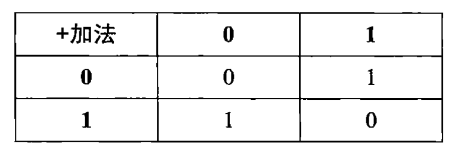

# Nand2Tetris

与 、与非

或、或非

异或、 等价

x->y 、y->x


## Project1 基本逻辑门

典型的计算机体系结构基于一组基本逻辑门，如 And、Or、Mux 等，以及它们的按位版本 And16、Or16、Mux16 等（假设是 16 位机器）。在这个项目中，您将构建一组典型的基本逻辑门。这些门构成了基本构建块，您将在以后的项目中构建计算机的 CPU 和 RAM 芯片。


### Nand

由于Nand被认为是原始的，所以没有必要实现它。

以Nand为基础元件，实现其他元件。

已经实现的元件可以用来实现别的元件。

**Nand门可以使用4个晶体管来实现：两个N型和两个P型。**

### Nor

Nor也被认为是原始的，所以没有必要实现它。

**Nor门可以使用4个晶体管来实现：两个N型和两个P型。**

### Not

**使用1个Nand实现Not**

```c
Not(x) = Nand(x,x)
```

- 因为Nand的其中两个逻辑，正好符合非门逻辑。输入同时为1时，输出为0。输入同时为0时，输出为1。

**最简单的非门不需要使用Nand实现。只需要使用两个晶体管即可实现**。

### And

**使用一个Nand和一个Not实现And**

```c
And(a,b) = Not( Nand(a,b) )
```

**因此与门的实现需要六个晶体管。（一个nand4个，一个not两个）**


### Or

**使用三个非门和一个与门实现Or**

```bash
Or = Not( And( Not(a), Not(b) ) )
```


**实际上Or可以通过或非门和一个非门实现。需要6个晶体管。**

### Xor

需要两个非门，两个与门，一个或门

```c
Xor = OR( And(a, Not(b)), And(Not(a), b) )
```

### Mux

使用二值逻辑，从真值表获得Mux逻辑表达式。

```c
Mux = ab'c' + abc' + a'bc + abc
	= (ab' + ab) c' + (a'b + ab ) c
	= ac' + bc'
```


### DMux

DMux的特点：

```
If sel=0 then {a=in, b=0} else {a=0, b=in}.
```


- 当sel为1时，输出a一直为0.输出b = 输入 in
- 当sel为0时，输出a = 输入 in 。输出a 一直为0。

```c
Not(in= sel, out= notsel);
And(a= in, b=notsel , out= a);  // If sel=0 then {a=in, b=0}
And(a= in, b= sel, out= b); // else {a=0, b=in}
```

### Not16

每个输入的位数增加。输出位也增加。

但是有可能只有两个输入。

### And16
### Or16
### Mux16
### Or8Way

输入数量增加。每个输入的位有可能还是一位。或多位。输出是一位。

### Mux4Way16

**4路（4输入）16位的选择器。**

### Mux8Way16

### DMux4Way

### DMux8Way

## project2 布尔运算

### 加法运算

**两个输入**： 加数a,加数b。

**两个输出**：加法位S，进位位C

#### 半加器

二进制加法运算分为两个独立的步骤：

- 加法运算：



- 进位运算


**与门**的真值表逻辑和进位运算完全一致。可以用与门实现进位运算。

**异或门**的真值表逻辑和加法运算完全一致。可以用异或门实现加法运算。


> **半加器实现：**


**半加器**没有考虑来自低位的进位。来自低位的进位也需要与与半加器的结果再次相加才 能实现 **多位加法**。

#### 全加器

- 首先，本位的加数（输入A,输入B）进行一次半加。
- 然后得到的**加法位**于来自低位的**进位**再次进行半加。得到的加法位为最终的**加和输出。**
- 两次半加 的 **进位位**进行 **或运算**。得到最终的**进位输出**

为什么只对**进位位**用或运算就可以了？而不需要加法（实现加法的逻辑是异或）？

**因为两个进位位不可能同时为1**。（如果第一次半加有**进位1**，则第二次半加的**输入B**一定为0.那么第二次半加的**进位位**一定为0。）

而或门和异或门的真值表，除了输入同时为1不同外。其他三个都是相同的。**所以这里可以简化使用或门。**


**简化图：**


#### 多位加法

有了全加器，我们就可以通过将他们连接通过**进位位**联系起来，构建一个多位加法器：

- **低位的进位输出**是**高位的进位输入**。
- 最低有效位（LSB）的进位输入接地。 (**最低位加法可以用半加器实现**)
- 最高有效位(HSB)的进位输出 连接到**溢出标志(OF)**上（overflow）。
- **中间位的进位输入**链接到**上一位的进位输出**。


有了八位加法器，可以扩展到任意位加法器（8X）。


#### 负数的表示 与减法

计算机中采用补码表示负数（n位二进制假设n = 4。）：

- -x用 $2^n$ - x 表示： -3 用 16 -3 =13 **|||** -5 = 16 -5 = 11

使用上面设计的加法器，原生就支持补码的减法。不需做任何修改。

> **原因是**：

- 上面的**加法运算** 实际上 不是真正的 数学意义上的加法 而是 **模2加法**：加法超过位数（溢出），会截断到模2以内。
- **补码的表示（编码）**实际上也是**模2表示**：表示超过位数（溢出），会截断到模2以内。

**所以，总之。在2的补码表示下，减法是很自然的事。怎么做加法。我们就怎么做减法。**

#### 求一个数的相反数

有了加法和减法，我们求一个数x的相反数非常简单：

x = $2^n$ - x = ($2^n$ - 1) - x + 1 .

- 第一步：使用（$2^n$ - 1=1111）减去x.被减数是全一，不需要借位。运算很简单。
- 第二步：结果加1：加一很特别只需翻转每一位知道遇到第一个0。1**0**11 + 1 = 1100  **|||** 01**0**1+ 1 = 0110

### ALU


**6个输入控制位：**

- zx:  if zx then x = 0;	如果zx位置位，我们就将x设置为0 。	
- nx: if nx then x = not(x)  如果nx置位，x取反
- zy：  同理
- ny： 同理
- f： if f then out = x + y else out = x &y .如果f置位，我们执行加运算。否则执行与运算。
- no： if no then out = not(out ) 。如果no置位，输出取反。

**2个输出控制位:**

```c
    zr,      // if (out == 0) equals 1, else 0
    ng;      // if (out < 0)  equals 1, else 0
```

#  参考

[NJU](http://ws.nju.edu.cn/courses/dm/courseware/20150504-Boolean_Algebra.pdf)
